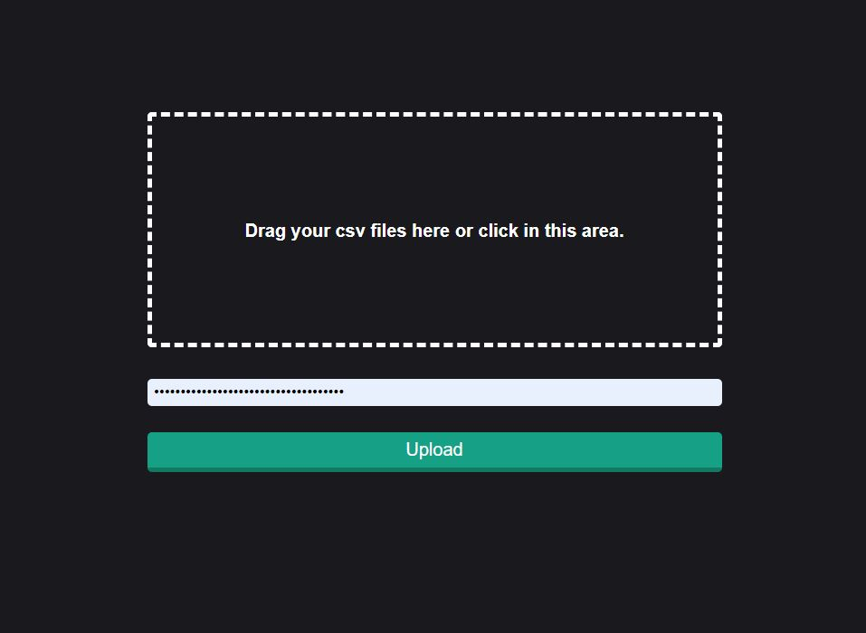

# eBay Parcer
### App Screenshot

### About
This is an eBay product price tracking web application. It was designed specifically for books but can be used for other products as well. You upload a CSV file containing product information and max price. There is a background job that will continuously search for your products on eBay. When an item is posted on eBay below the specified max price an email notification will be sent. Your eBay private key is required to upload CSV files.

### Running the application
You will need an eBay developer key for the eBay search API, as well as a Google developer key for emails.

### Upload Instructions
Multiple CSV files can be uploaded at the same time. The files must contain a 'book_id' and 'max_price' columns. When new Excel files are uploaded previously Excel files will be deleted.
